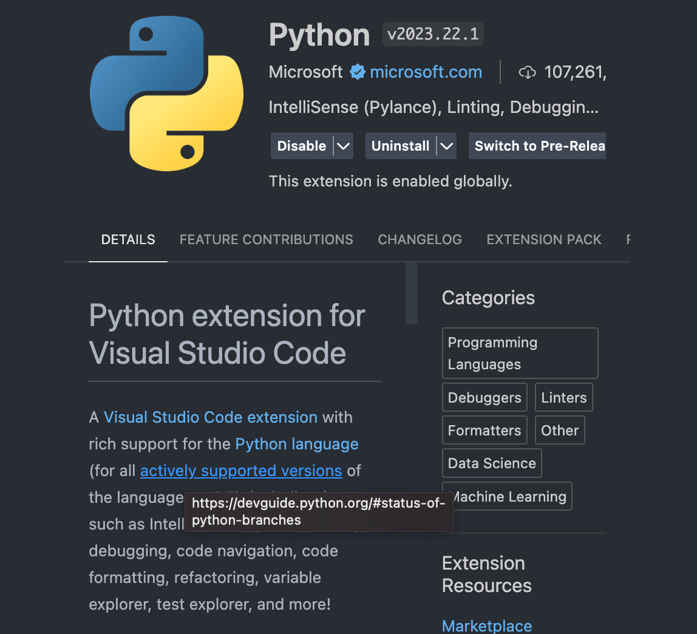
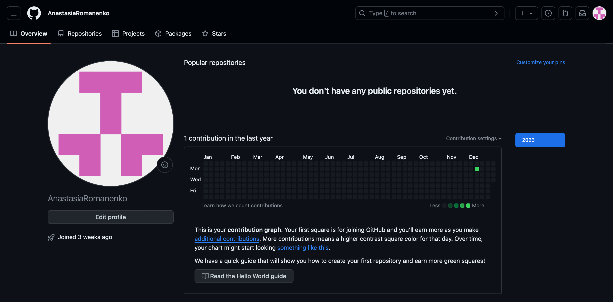
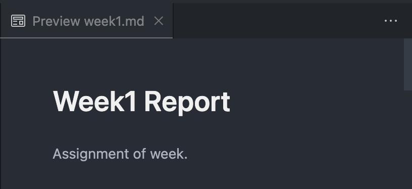

# Week1 Report

Assignment of week.

## Computer

1. Teorical knowledge of how CPU and RAM works, and why we need them. Can we use something else instead of them?

   The `CPU` is basicaly the brain of the computer. It is responsible for executing instructions and computations. It contains an ALU (Arithmetic Logic Unit) for basic mathematical operations, control units for managing data flow between CPU and other components, and registers for temporarily storing data.

   `RAM` is temporary, high-speed storage that allows the CPU to quickly access and modify data. It holds the active data that the CPU is currently processing or using. The more RAM a computer has, the more applications it can handle simultaneously without slowing down.

   We need CPU because it allows a computer to run any programs or applications. With PAM, CPU can load programs and data to execute.

   No single alternative has yet provided a wholesale replacement for their functionality.

2. What is gHZ in modern CPUs and why they are changing according to the load of the computer?

   `GHz` is a unit of measurement for frequency and clock speed in CPUs. A higher GHz rating means the CPU can execute more instructions per second.

   - When a CPU is idling or running light tasks, it can lower its clock speed to save power. The CPU may throttle down to a few hundred MHz.

   - When the CPU encounters a workload that requires more processing power, it can increase its clock speed. The CPU may ramp up to its maximum rated GHz to provide more performance.

   - The CPU clock speed can change on the fly as needed based on the instructions it receives and its workload.

3. What is x86, x64 and arm architectures, and why phones and computer has different architecture?

   - `x86`: This is an instruction set architecture developed by Intel for its 8086 microprocessor. It has evolved over time, leading to the 32-bit x86-32 and the 64-bit x86-64 (also known as x64).

   - `x64`: This is an extension of the x86 architecture, designed to support 64-bit computing. It allows for addressing a larger amount of memory and executing more efficient instructions.

   These architectures are widely used in personal computers (PCs) and supported by operating systems, such as Windows, Linux, and macOS.

   - `ARM`: This is an instruction set architecture which is used primarily in mobile devices like smartphones, tablets, and other embedded systems. ARM architecture's low power consumption and flexibility make it well-suited for mobile devices with battery power constraints. Operating systems like Android and iOS are designed to run on ARM-based CPUs.

   - x86 and x64 CPUs are used in PCs because they are generally faster for complex tasks, while ARM CPUs are more power efficient for simpler mobile tasks. ARM CPUs also generate less heat which is important for mobile devices.

4. Why C language is the best thing ever in the world from point of view of the assembly developer. + Why assemply language sucks?

   There are several reasons why the C language is much better than assemply:

   - C is a higher level language. It abstracts away low-level details of the machine architecture. In C, you program with constructs like functions, loops, and variables rather than raw machine instructions. This makes C code much easier to read, write, and maintain than assembly.

   - C is portable. Because C code is abstracted from the underlying architecture, it can be compiled for many different platforms. Assembly code is architecture-specific and not portable. C allows you to write once and run everywhere.

   - C has built-in functions and data structures. In C, you get built-in support for strings, math functions, I/O, etc. In assembly, you have to implement everything from scratch. This makes C much more productive and convenient.

   - C code is easier to debug. Debugging C code is far simpler than debugging assembly code at a raw machine instruction level.

   - C integrates with high-level tools. C integrates with debuggers, libraries, and other tools that assembly does not.

5. When you press the power button, how is your computer actually works? (Briefly learn what is bios, uefi then bootloader then starter of the OS)

   when you press the power button:

   1. The BIOS/UEFI initializes the hardware and loads firmware settings
   2. The BIOS/UEFI locates a bootable device and loads its bootloader
   3. The bootloader loads the operating system kernel
   4. The kernel loads essential device drivers
   5. The kernel starts background services and the graphical interface
   6. The desktop environment loads, and the computer is ready to be used

   So in summary, The BIOS/UEFI and bootloader provide the preliminary steps to get the operating system up and running. The operating system kernel then takes over to get the computer into an operational state with all its hardware and software loaded and ready to use.

6. Briefly learn what is kernel, how it helps to OS.

   A `kernel` is the core software component of an operating system. It acts as a bridge between applications and hardware resources. The kernel provides vital services like process, memory and file management, device communication, system calls, security, and scheduling to facilitate the functioning of the entire system. Without the kernel, an operating system would not operate.

7. What is Unix/Linux and what is their advantages from point of view of the last user. (Last user represents who only uses computer, not developes anything.) Learn why Windows sucks.

   `Unix` and `Linux` are families of operating systems primarily designed for servers, computer networks, and personal computers. Unix is an influential multi-user, multi-tasking operating system. Linux is a popular variant of the Unix-like operating system family, built around the Linux kernel.

   Advantages for end users:

   - Unix/Linux systems are generally more secure. They have a simpler design, stronger security model, and fewer vulnerabilities Windows. There are less malware and viruses targeting Unix/Linux.

   - Unix/Linux systems are typically more stable. They are designed to run for long periods without interruption. While Windows may require frequent reboots, Linux systems can run for months or years without issues.

   - Unix/Linux usually has lower system requirements. It can run well even on older hardware with limited resources. But Windows requires more CPU power, RAM, and storage to run compared to a Linux distribution. This means Windows may run poorly on older hardware.

   - Unix/Linux often has lower cost software. Much of the software for Linux is open source and free to use. While commercial software is also available, there are more options for free software on Linux than on Windows.

   - Linux offers more flexibility to customize the system compared to Windows. End users have more control over the interface, services, and software.

#Development

1. Briefly check why python is exist and why it's that popular-easy.

   `Python` is a popular, easy to use programming language because it is readable, has a simple syntax, is easy to install, has many libraries, is free and open-source, works for both scripting and applications, and has a dynamic type system. All of these factors combined make Python an accessible, practical, and powerful language for programmers of any skill level.

2. Install and setup latest version of python3 and pip3 to your mac. Python and pip should be accesable from the terminal.  

   Python3 from the terminal:
   ```bash
   nastya@Air-Anastasia ~ % python3 --version  
   Python 3.9.6
   ```
   _Note:_ it is not the last version, but I will use it.

    Pip3 from the terminal:
   ```bash
   nastya@Air-Anastasia ~ % pip3 --version  
   pip 23.3.2 from /Users/nastya/Library/Python/3.9/lib/python/site-packages/pip (python 3.9)
   ```  


3. Setup your vscode ide as you are python developer. Install all important extensions (python linter, language server, snippets bla bla).  

   
     
4. Learn shortcuts of the vscode. Real developer always avoid to use mouse for almost anything. You will use key combinations (ctrl + f5 for example) to execute and debug.  

   We can explore shortcuts by going to "Code" > "Preferences" > "Keyboard Shortcuts" in the menu bar.
5. We will everytime use terminal. You have terminal in your mac computer. Learn how to execute your terminal with shortcut. (For example, I am pressing f12 to use my drop-down terminal in anywhere.)

   I crearted a shortcut for opening a terminal - `⌘ ⌥ ^ space`.
6. Learn what is static typed and dynamic typed programming language and why we have this difference. Explain which of one does python use.

   Programming languages are categorized as either `statically typed` or `dynamically typed`. This refers to how the language handles variable types:

   * Statically typed languages specify the data type of a variable when it is declared. The type is fixed and cannot change. Examples are Java, C, and C++.

   * Dynamically typed languages do not specify variable types when declared. The type can change as the program runs. Examples are Python, Ruby, and JavaScript.

    The difference between them allows programmers to choose what they need more: safety or flexibility.  
    Statically typed languages promote safety and performance at the cost of flexibility, while dynamically typed languages favor flexibility at the cost of some safety and performance. 
   
7. Write some dump code with python, with vscode. It can be like declare variables, print them. Read string from the terminal and print to the screen. Generate random number, take input from user, make it int and compare with your random number. If they wouldn't match, mass with the user. And finally run your application from terminal.

   My code:
   ```python
   import random
   # declare variables
   name = "Anastasia"
   ageStr = '18'
   #Convert str to int
   age = int(ageStr)
   #print them
   print(name)
   print(age)
   #Read string from the terminal and print to the screen
   name = input("Enter your name: ")
   print("Hello", name)
   #Generate random number
   random_num = random.randint(1, 10)
   #take input from user, make it int 
   num = int(input("Guess the number from 1 to 10: "))
   #compare with your random number
   while num != random_num:
       #If they wouldn't match, mass with the user
       num = int(input("Guess the number again: "))
   print("You guessed it!")
   ```
   Output:
   ```bash
   nastya@Air-Anastasia ~ % python3 /Users/nastya/Desktop/week1/week1.py
   Anastasia
   18
   Enter your name: yourName
   Hello yourName
   Guess the number from 1 to 10: 1
   Guess the number again: 2
   Guess the number again: 3
   You guessed it!
   ```
8. Briefly learn what is git? and why we need version control system while developing something.

   `Git` is a popular version control system that allows you to track file changes, collaborate, manage branches, and restore previous versions. For any software project, using version control is important for managing work between team members and maintaining a history of changes made to the codebase over time.
9. Create a github account.

   
10. Learn what is Markdown format and why developers like to use. Vscode has support of markdown (fileformat of .md)

    Markdown is a simple yet useful markup language for formatting text. It is easy to learn and use, produces clean output, works with many tools, can be extended, and promotes productivity. These benefits make Markdown popular with developers, writers, and content creators.

11. Create week1.md with vscode and write report of this research. You should explain all what you learnt. While writing your report, you can use preview of markdown in vscode. (It will automaticly format your markdown, with that way, you will know that how it will look like)   
    
    

12. Finally, create a repo that you will send your reports to github and upload your week1.md.  

    Done 😃
