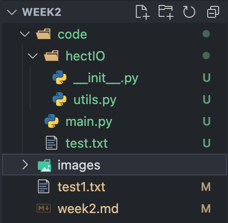

# Git
- Install git and be sure that you can access from your terminal.  

   To intall Git on Mac I used the following command:
   ```bash
   brew install git
   ```
   To ensure that I can access it from my terminal I check its version:
   ```bash
   nastya@Air-Anastasia ~ % git --version
   git version 2.39.3 (Apple Git-145)
   ```
- Be familiar with git add, git commit and git remote and git push commands.

   To initialize empty Git repository I typed `git init` command.  
   To add "test1.txt" file - `touch test1.txt` and `git add test1.txt`.  
   To commit changes - `git commit -m "added test1.txt"`.  

   Output:
   ```bash
   [main (root-commit) d8d530d] added test1.txt
   1 file changed, 0 insertions(+), 0 deletions(-)
   create mode 100644 test1.txt
   ``` 

   A `remote` is another location from where we are currently working.
   In this report Github is a remote repository.   
   `git remote` - displays our remotes.
   `git remote -v` - shows us full locations.
   ```bash
   nastya@Air-Anastasia MyWeeklyReports % git remote
   origin
   nastya@Air-Anastasia MyWeeklyReports % git remote -v
   origin	https://github.com/AnastasiaRomanenko/MyWeeklyReports.git (fetch)
   origin	https://github.com/AnastasiaRomanenko/MyWeeklyReports.git (push)
   ```
   
   `git push` - pushes our edits to our remote.
   
- Use git cli to upload new files to the github.

    - You will use (git clone, git add, git commit and git push comments.)
    - For them, you should add your access token to your git conf. (ask to the net please: setup git for github)  
    
    I accidently closed my terminal  when I used `git clone`, `git add`, `git commit` commands.  
   But `git push` is presented below.
    ```bash
   nastya@Air-Anastasia MyWeeklyReports % git push origin main
   Username for 'https://github.com': anastasiaromanenko2005@gmail.com
   Password for 'https://anastasiaromanenko2005@gmail.com@github.com': 
   Перерахування обʼєктів: 9, готово.
   Підрахунок обʼєктів: 100% (9/9), готово.
   Дельта компресія з використанням до 4 потоків
   Компресія обʼєктів: 100% (6/6), готово.
   Запис обʼєктів: 100% (6/6), 607 байтів | 202.00 КіБ/с, готово.
   Всього 6 (дельта 2), повторно використано 0 (дельта 0), повторно використано пакунків 0
   remote: Resolving deltas: 100% (2/2), completed with 2 local objects.
   To https://github.com/AnastasiaRomanenko/MyWeeklyReports.git
   8601e07..8bba55b  main -> main
   ```
# Programming 

- What are interpreter languages, vm languages and compiled programming languages.
    - How safe are they as manipulations from outside of the application, what requirements do they have. Explain all of them, give examples and compare them in markdown table. 


    | Languages    | Interpreter                                 | VM                                                                  | Compiled programming                                                                       |
   |--------------|---------------------------------------------|---------------------------------------------------------------------|--------------------------------------------------------------------------------------------|
   | Definition   | executed directly by an interpreter program | compiled into bytecode, which is then executed by a virtual machine | translated into machine code specific to the target hardware architecture before execution |
   | Safety       | less safe than compiled languages           | more safe than interpreter languages                                | safer than interpreter or VM languages                                                     |
   | Requirements | interpreter program or environment          | a virtual machine or runtime environment                            | a compiler                                                                                 |
   | Examples     | Python, Ruby, JavaScript and Perl           | Java and C#                                                         | C, C++, Go and Rust                                                                        |

- Learn basic conditions with Python (if, elif, else,default)  

   `if` - to check a condition.  
   `elif` - to check another condition after the previous one is false.  
   `else` - to be used if all conditions are false.  
- Run python in interactive mode and try to write some basic conditions.

   Output:
   ```bash
   >>> a = 6
   >>> bStr = input("Enter a number: ")
   Enter a number: 4
   >>> b = int(bStr)
   >>> if b > a: print("b > a")
   ... elif b == a: print("b = a")
   ... else: print("b < a")
   ... 
   b < a
   ```
- Run python in interactive mode and try to write some basic loops.  

   `while` loop:
   ```bash
   >>> while i < 4:
   ...   print(i)
   ...   i += 1
   ... 
   1
   2
   3 
   ```
   `for` loop:
   ```bash
   >>> for x in range(4):
   ...  print(x)
   ... 
   0
   1
   2
   3
   ```
- Run python in interactive mode and use help() built-in function to learn more about python built-in functions. `eg: help(print), help(range), help(len)`   

   After typing `help()` a welcoming message appears with an instruction on how to search for modules, keywords, symbols, or topics.  

- Learn basic loops with Python (for, while. forEach)
  - Learn what range() built-in function does and how to use it.  

    `range(i)` - produces 0, 1,  2, ..., i-1.  
  `range(i, j)` - produces i, i+1, i+2, ..., j-1.
  - Explain this code snippet:
    ```python
    for i in range(10):
        print(i)
    ```
    The first value of `i` is 0. It increases by 1 until its value is 9.

  - Explain this code snippet:
    ```python
    for i,b in enumerate(range(10)):
        print(i,b)
    ```  
    `enumerate()` is used in a for loop to get a number and its index.   
    `i` represents the index. It starts with 0 and increases by 1 until its value is 9.
    `b` represents the number. It starts with 0 and increases by 1 until its is 9. 
    In this case values of `i` and `b` are the same, but if `b` started from another value, they would be different.  
    Let's say `b` starts from 1.  
    Output:
    ```bash
    >>> for i,b in enumerate(range(1, 10)):  
    ...  print(i, b)  
    ...   
    0 1  
    1 2  
    2 3  
    3 4  
    4 5  
    5 6  
    6 7  
    7 8  
    8 9  
    ```

  - Explain this code snippet:
    ```python     
    for i in [range(1),range(2),range(3)]:
        print(i)
    ```  
    `[range(1),range(2),range(3)]` is a list of 3 objects. 
    `i` acts as an element of this list. During the first iteration its value is `range(0, 1)` because the first element of the list is `range(1)`, which starts from 0. During next ierations  `range(0, 2` and `range(0, 3)` are printed as next elements of the list.

- Declare a str variable and use it's bult-in methods. `eg: str.upper(), str.lower(), str.split()`
   ```bash
   >>> myName = "My name is Anastasia"
   >>> str.upper(myName)
   'MY NAME IS ANASTASIA'
   >>> str.lower(myName)
   'my name is anastasia'
   >>> str.split(myName)
   ['My', 'name', 'is', 'Anastasia']
   ```
- Declare a list variable and use it's bult-in methods. `eg: list.append(), list.pop(), list.remove()`. After every operation print the list and the length of the list to the screen.
   ```bash
   >>> myNameList = ['My', 'name', 'is', 'Anastasia']
   >>> len0 = len(myNameList)
   >>> print(len0)
   4
   >>> myNameList.append("Romanenko")
   >>> print(myNameList)
   ['My', 'name', 'is', 'Anastasia', 'Romanenko']
   >>> len1 = len(myNameList)
   >>> print(len1)
   5
   >>> myNameList.pop(4)
   'Romanenko'
   >>> print(myNameList)
   ['My', 'name', 'is', 'Anastasia']
   >>> len2 = len(myNameList)
   >>> print(len2)
   4
   >>> myNameList.remove("is")
   >>> print(myNameList)
   ['My', 'name', 'Anastasia']
   >>> len3 = len(myNameList)
   >>> print(len3)
   3
   ```

- Declare a dict variable and use it's bult-in methods. `eg: dict.keys(), dict.values(), dict.items()`. For sure don't forget to use `dict["abc"]` shape to really use dicts. After every operation print the dict and the length of the dict to the screen. Also create for range loop with key and value and print them to the screen. `eg: for key,value in dict.items(): print(key,value)`
   ```bash
   >>> dict = {'a': 1, 'b': 2, 'c': 3}
   >>> len0 = len(dict)
   >>> print(dict)
   {'a': 1, 'b': 2, 'c': 3}
   >>> print(len0)
   3
   >>> print(dict.keys())
   dict_keys(['a', 'b', 'c'])
   >>> print(dict.values())
   dict_values([1, 2, 3])
   >>> print(dict.items())
   dict_items([('a', 1), ('b', 2), ('c', 3)])
   >>> dict["d"] = 4
   >>> print(dict)
   {'a': 1, 'b': 2, 'c': 3, 'd': 4}
   >>> len1 = len(dict)
   >>> print(len1)
   4
   >>> dict.pop("b")
   2
   >>> print(dict)
   {'a': 1, 'c': 3, 'd': 4}
   >>> len2 = len(dict)
   >>> print(len2)
   3
   >>> for key, value in dict.items():
   ...  print(key, value)
   ... 
   a 1
   c 3
   d 4
   ```

- Learn file operations with Python (exist, read, write, seek bla bla)  
   `exists` - checks if the path exists.  
   `read` - reads the content of the file.  
   `write` - writes the content to the file.  
   `seek` - changes the position of the cursor to specific location.  
   ```bash
   >>> import os.path
   >>> isExist = os.path.exists(path) 
   >>> print(isExist) 
   True
   >>> f = open("myfile.txt", "w+")
   >>> f.write("Hello world!")
   12
   >>> f = open("myfile.txt", "r+")
   >>> print(f.read())
   Hello world!
   >>> f.seek(6)
   6
   >>> print(f.read())
   world!
   ```

- Learn functions in Python
    - Create sample app with these features
      - Create a function that returns random str with constant length `eg: getRandomStr(10)`
      - Create a function who takes 2 arguments as filename and content and writes it to the file. `eg: writeToFile('test.txt', 'fia9JGN@g')`
      - Create a function that takes 1 argument as filename and reads the content of the file as string and returns it. `eg: readFromFile('test.txt')`
      - Create a function that returns user input as string. `eg: getUserInput()`
      - Finally create another dummy python app with these functions which will ask user to enter a filename, if the file is exists, it will read the content of the file and print it to the console, if the file is not exists, it will create random string with length 10 and write it to the file and print it to the console.
      - Make console prints colorful. `eg: print('\033[31mHello world!\033[0m')`_(You can change the color code but don't forget to reset the color code at the end of the string.)_

      ```bash
      nastya@Air-Anastasia week2 % python3 week2.py
      Enter a filename: test.txt
      Creating a random string:
      ]A#YG>3Dk2
      nastya@Air-Anastasia week2 % python3 week2.py
      Enter a filename: test.txt
      The content of the files: 
      ]A#YG>3Dk2
      ```

      
- Learn what are map, dict, set, list, array etc.  
   `map` - applies each element from the group of elements to the function.  
   `dict` - contains keys (like "a, b, c, ..., z") and their values.  
   `set` - an unordered collection of unique items.  
   `list` - an ordered collection that can contain different object types.  
   `array` - contains items of same data type.

- Write so basic python library and import it in your main application. `eg: import hectIO; hectIO.getRandomStr(10)`. Devise correct pathing for your library.  

   The hierarchy of the project after importing a library is presented below.  

   

    
# Os

In Python, there is a built-in library called `os`. This library is used for operating system operations. You can use it for file operations, process operations, environment variables etc. And again in Python, everything is already done for you. This is why it looks like you can do everything with only peace of code. But in reality, it is not. You should know what is happening on the background. Python or other most programming languages are just a wrapper for the operating system. For example when you want to do anything with files, you should ask to OS and it should do it for you. It is calling system calls. 

- How exactly (deeply) python works with files. How it is creating a file in the disk (hint is syscalls)  

   For perfiming operations on files Python uses `system calls`, which are requests made by running processes to the operating system. These system calls make changes to the binary data on disk.  

- Execute your previous dump python application and while it is running INTERRUPT the application with shortcut (mostly Ctrl+C). Explain what happened and why.
   ```bash
   Enter a filename: ^CTraceback (most recent call last):
   File "/Users/nastya/Desktop/MyWeeklyReports/week2/code/main.py", line 22, in <module>
       filename = getUserInput()
   File "/Users/nastya/Desktop/MyWeeklyReports/week2/code/main.py", line 18, in getUserInput
       name = input("\033[31mEnter a filename: \033[0m")
   KeyboardInterrupt
   ```  
   The operating system sends `SIGINT` (Interrupt signal) to the running Python process. This signal interrupts the execution of the program. After that, `KeyboardInterrupt` exception is raised. The program starts handling this exeption.  

- Learn application signals  

   `Signals` are interrupts sent to process to indicate that a specific event has occurred.  

- Learn how to send signal to running application without shortcuts (send SIGTERM to python and use terminal for this). `(eg: killall python -SIGTERM`  
   For some reason this command is not working for me. On different OS command may not be the same. 
   So I created a `test.py` file with the following content:
   ```python
   import time
   while True:
      print("Running...")
      time.sleep(1)
   ```
   I ran this file in VS code, but in Terminal (an app) I typed `pgrep -fl test.py` to find the process ID. I got this ID (88832) and used `kill -SIGTERM 88832` command to send a SIGTERM signal, making the program shutdown. 
   ```bash
   nastya@Air-Anastasia week2 % /usr/local/bin/python3.12 /Users/nastya/Desktop/MyWeeklyReports/week2/code/test.py
   Running...
   Running...
   ...
   Running...
   zsh: terminated  /usr/local/bin/python3.12 
   ```


# IP - Web

- What is IP address, what is the difference between IPv4 and IPv6  

   An `IP address` is a unique address that identifies a device on the internet or a local network.
   - `IPv4` - 32 bit. It consists of 4 decimal values between 0-255 separated by dots.
   - `IPv6` - 128 bit. It consists of 8 groups with 4 hexadecimal values each separated by colons.

- What is local IP address, what is public IP address  

   - `A local IP address` is used to locate a device in a private network. Local IPs cannot be seen online.
   - `A public IP address` is used to locate a device across the entire i
   Internet. Public IPs can be seen online.

- What is domain  

   `Domain` is a unique address used to access websites.

- What is DNS, why we need them.  

   `DNS` is the system that stores domain names and links them with their proper IP addresses. We need it so that we don't have to remember IPs.
- Query to 1.1.1.1 (cloudflare dns) and ask google.com's IP address with terminal. Which ip version is it?  
   After entering `dig @1.1.1.1 google.com` command to the Terminal, the obtained result is `216.58.208.206`, which is IPv4.

- What is HTTP, what is HTTPS  

   `HTTP` is used to transmit data over the web and is not encrypted.  

   `HTTPS` is the secure version of HTTP, so it is encrypted.

- What is TCP, what is UDP  

   - TCP allows devices to send data across a network and verify its delivery.  
   - UDP allows device to send data across a network without verifying its delivery.

- Compare HTTP and HTTPS, TCP and UDP   
   - HTTP is faster than HTTPS, but not encrypted.
   - HTTPS's communication protocol is encrypted using Transport Layer Security.
   - TCP is more reliable but it transfers data more slowly. 
   - UDP is less reliable but works more quickly.

- Explain why HTTP is not secure and why HTTPS is secure  

   - `HTTP`:  hyper-text goes as usual text, that's why anyone between the browser and server can read it relatively easily.  
   - `HTTPS`: connections are secured with a digital security protocol that uses cryptographic keys to encrypt data.

- Which protocol is used for HTTP/S  

   `TCP` is used for HTTP/S

# Snippets

- Write small account manager. It should ask name from the user. If you have already saved the name to the file (filename would be the same with the name), read data inside the file and print it to the screen. If you have not saved the name to the file, ask user to enter his/her age and write it to the file. `eg: python account.py`
  - What is your name? nastia
  - [checks if there is a file named nastia]
  - What is your age? 25
  - [writes 25 to the file named nastia]
  - [prints 25 to the screen]
  
  Output:
   ```bash
   nastya@Air-Anastasia code % python3 pythonAccount.py
   What is your name? nastya
   Enter your age: 18
   18
   nastya@Air-Anastasia code % python3 pythonAccount.py
   What is your name? nastya
   Data inside the file: 
   18
   ```
- Write small account manager which will also store password. Use the same magic as above. But this time ask password from the user with name. Read the file which has the same name with the user and check if the password is correct. If it is correct, print the age to the screen. If it is not correct, ask password again. `eg: python account.py`
  - What is your name? nastia
  - [checks if there is a file named nastia]
  - What is your password? 1234
  - [checks if the password is correct]
  - [if it is correct, prints the age to the screen]
  - [file content can be like this: 25,1234]  
   
   Output:

  ```bash
   nastya@Air-Anastasia code % python3 pythonAccount.py
   What is your name? nastya
   Set your password: 1234
   Enter your age: 18
   18
   nastya@Air-Anastasia code % python3 pythonAccount.py
   What is your name? nastya
   Enter your password: 1111
   The password is incorrect! Enter it again: 2222
   The password is incorrect! Enter it again: 1234
   Data inside the file: 
   18
   ```
   _P.S. I am not 25 !!!_ 

- Write application that will close your computer when you execute :)
   ```bash
   nastya@Air-Anastasia code % python3 close.py
   Do you want to close your computer? yes
   Password:
   [Відновлено 5 січ. 2024 р., 16:28:45]
   Last login: Fri Jan  5 16:28:33 on console
   /Users/nastya/.zsh_sessions/A590F300-79CC-4860-83F7-E73176C11C80.session:2:
   command not found: Saving
   nastya@Air-Anastasia code % 
   ```

# Report

Do the same with previous week. Create a report file and write what you have learned this week. Also write what you have done this week. But this time try to use your own words.  

   Done 😃