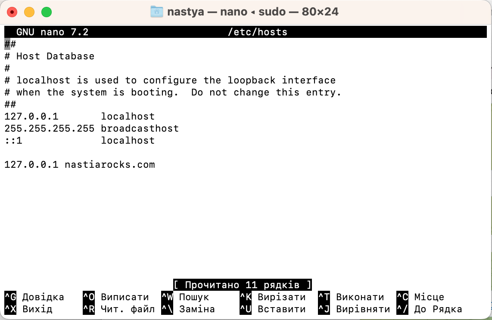
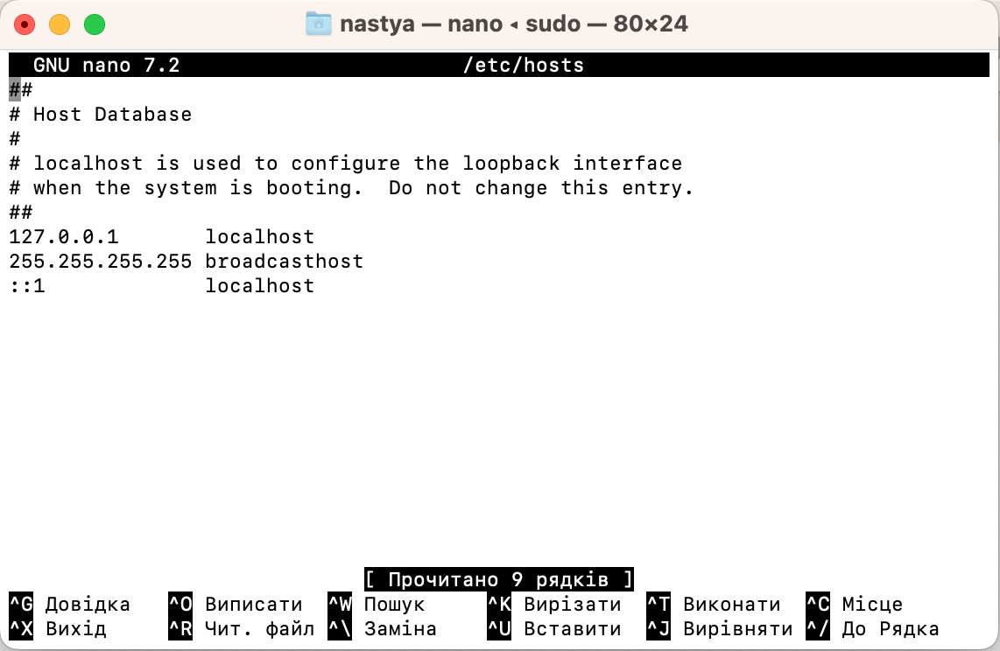
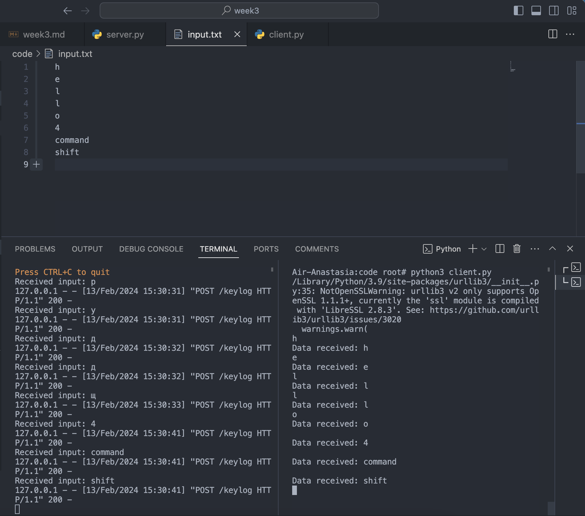
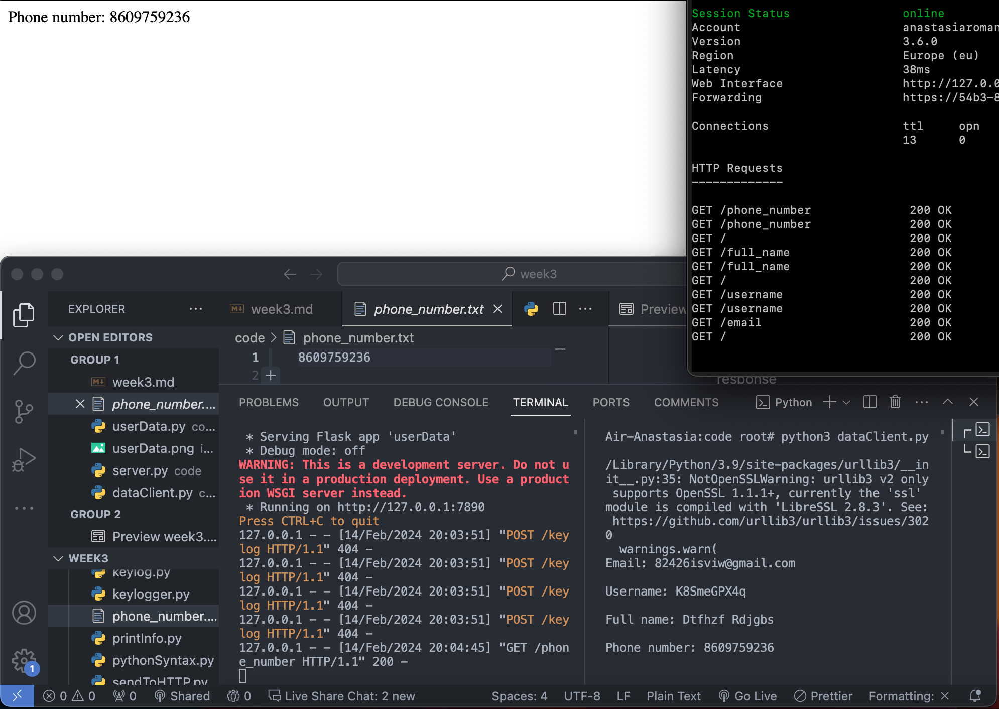

## Tools

Tools that you should install

- pip  

   ```bash
   nastya@Air-Anastasia ~ % pip3 --version
   pip 23.3.2 from /Users/nastya/Library/Python/3.9/lib/python/site-packages/pip (python 3.9)
   ```
- curl

   ```bash
   nastya@Air-Anastasia ~ % curl --version
   curl 8.1.2 (x86_64-apple-darwin22.0) libcurl/8.1.2 (SecureTransport) LibreSSL/3.3.6 zlib/1.2.11 nghttp2/1.51.0
   Release-Date: 2023-05-30
   Protocols: dict file ftp ftps gopher gophers http https imap imaps ldap ldaps mqtt pop3 pop3s rtsp smb smbs smtp smtps telnet tftp
   Features: alt-svc AsynchDNS GSS-API HSTS HTTP2 HTTPS-proxy IPv6 Kerberos Largefile libz MultiSSL NTLM NTLM_WB SPNEGO SSL threadsafe UnixSockets
   ```
- jq

   ```bash
   nastya@Air-Anastasia ~ % jq --version
   jq-1.7.1
   ```

## Search

- TCP
    `TCP` allows devices to send data across a network and verify its delivery.  
- HTTP
   `HTTP` is used to transmit data over the web and is not encrypted.  
- CURL 
   `CURL` is a command line tool that is used to transfer data to and from a server.
- JSON
   `JSON` is a lightweight format for storing and transporting data which is often used when data is sent from a server to a web page.

## Python Syntax

- Learn what is try, except, else in python. Make small sample with files. Try to read not existent file and if there is an error while doing this, print to the screen with cute colorful format.  
The source code:
    ```python
   try:
    with open('file.txt', 'r') as file:
        content = file.read()
    except FileNotFoundError:
        print('\033[31mNo such file\033[0m')
    else:
        print('\033[32mFile content: \033[0m', content)
    ```
   The output:
   ```bash
   nastya@Air-Anastasia code % python3 pythonSyntax.py
   No such file
   ```
- Learn what is the difference between `with` and `open` while opening files.
   - `with` is used to simplify the code and make it more readable. We don't need to call `file.close()` when using `with` statement, it is done automaticaly. 

   - `open` is used to open file and return a stream.

- Learn how to use pip (python package manager), install `requests` and `flask` libraries.  

   To install these libraries I used the follwoing commands:
   ```bash
   pip install requests
   ```
   
   ```bash
   pip install flask
   ```
## Tcp/Udp

- Create tcp server with python, listen all incoming data and print. Name this script server.py
   ```bash
   Connected by ('192.168.30.142', 56033)
   Get smth from client: 123
   Get smth from client: Hello
   Get smth from client: FINALLY OMG
   ```
- Create client.py to connect servers tcp socket. Create an infinite loop and read data from the console (stdin) and send to the server with connected socket. You should able to see all the data from the server.   

   ```bash
   nastya@Air-Anastasia code % python3 clientTCP.py
   Send smth to server: 123
   Send smth to server: Hello
   Send smth to server: FINALLY OMG
   ```
- While your python application waiting use to type something to the console, interrupt the python application and check what will happen to the server application because drop of the connection between server and client. Why it happened? How to solve this?  

   I generated `KeyboardInterrupt` exeption.   

   _`clientTCP.py:`_
   ```bash
   Send smth to server: ^CTraceback (most recent call last):
   File "/Users/nastya/Desktop/MyWeeklyReports/week3/code/ client.py", line 8, in <module>
    message = input("Send smth to server: ")
   KeyboardInterrupt
   ```
   _`serverTCP.py:`_
   ```bash
   Get smth from client: 
   nastya@Air-Anastasia week3 % 
   ```
   As we can see the program ends. Because it detects that no data was send, but something else.  

   We can comment one condition in our code:
  
   ```python
   #if not data:
      #break 
   ```
   And then add the follwoing part of code to handle `KeyboardInterrupt`: 
   ```python
   except KeyboardInterrupt:
    print("KeyboardInterrupt detected. Exiting...")
    sys.exit(0)
    ```  

- Execute your client.py while server.py is not working. Before executing think about what will happen. What happened?   

   There is a connection error:
   ```bash
   nastya@Air-Anastasia code % python3 clientTCP.py
   Traceback (most recent call last):
     File "/Users/nastya/Desktop/MyWeeklyReports/week3/code/client.py", line 6, in <module>
       s.connect((SERVER, PORT))
   ConnectionRefusedError: [Errno 61] Connection refused
   ```

- Pick 80 or 443 port to create the server. Your OS should refuse this request. Why is that? Learn more about ports and their standard assigment. (ssh, http, tls, ftp, dns etc)
   
   We can't use 80 or 443 port because ports from 0 to 1023 are reserved for well-known services such as HTTP (80) and HTTPS (443). 
   
   ```bash
   Traceback (most recent call last):
  File "/Users/nastya/Desktop/MyWeeklyReports/week3/code/server.py", line 10, in <module>
    s.bind((SERVER, PORT))
   PermissionError: [Errno 13] Permission denied
   ```
- Repeat the first four step but this time use udp. What is the difference between tcp and udp? Did you get error while using client.py while the socket is udp and server is not working?
   
   _`serverTCP.py:`_
   ```bash
   Get smth from client: 321
   Get smth from client: Bye
   Get smth from client: :)
   ```
   _`clientTCP.py:`_
   ```bash
   nastya@Air-Anastasia code % python3 clientUDP.py
   Send smth to server: 321
   Send smth to server: Bye
   Send smth to server: :)
   ```
   - TCP establishes a connection, it is more reliable but it transfers data more slowly. 
   - UDP does not establish a connection, it is less reliable but works more quickly.

   I did not get an error while using client.py while the socket is udp and server is not working because UDP does not establish a connection, so it doesn't check if server is listening. All data is lost, but we don't get an error. 


## Web

- I want you to learn what is http and how is it working. (meta messages of http request and response)
   
   `HTTP` is a protocol used for transmitting data over the Internet. It follows a client-server model, where the client sends a request to the server and the server responds to that request.

- Learn status codes of http responses, and requests types (GET,POST,DELETE etc)
   
   **Status codes HTTP responses:**
   - `100` - Continue
   - `101` - Switching Protocols
   - `200` - OK
   - `201` - Created
   - `202` - Accepted
   - `203` - Non-Authoritative Information
   - `404` - Not Found : The requested resource was not found on the server.
   - `500` - Internal Server Error : The server encountered an error while processing the request.
   - `301` - Moved Permanently: The requested resource has been permanently moved to a new URL.

   **Requests types:** 
   - `HEAD` - is used to ask the server for status (size, availability) of a resource.
   - `GET` -	is used to retrieve a resource.
   - `POST` - is used to create a new resource.
   - `PUT` - is used to edit/update an existing resource.
   - `DELETE` - ised to delete a resource.

- Send http request with python to http://httpbin.co/anything and print the response to the screen .   

   ```python
   import requests

   response = requests.get('http://httpbin.co/anything')
   print(response.text)
   ```
    
- Send https request with python to https://httpbin.co/anything and print the response to the screen. What was different from the previous task?
   
   ```python
   import requests

   response = requests.get('https://httpbin.co/anything')
   print(response.text)
   ```
   In this task we use HTTPS, but in the previous - HTTP.

- What is the Json and where, why we are using it. Type sample json array.
   
   `JSON` is a lightweight format for storing and transporting data. It is often used when data is sent from a server to a web page.

   ```json
   {
   "Dogs":[
       {"breed":"Husky", "name":"Tom"}, 
       {"breed":"Dalmatian", "name":"Peter"},
       {"breed":"Сhihuahua", "name":"Bony"}
   ]
   }
   ```

- Read the response of httpbin.co/anything and print your ip address. (Parse the response body as json and get ip key).
   ```python
   import requests
   import json

   response = requests.get('http://httpbin.co/anything')
   data = json.loads(response.text)
   print(data['ip'])
   ```

- __OPTIONAL:__ Install jq tool to better preview of json> `curl "https://random-data-api.com/api/v2/users" | jq`  

   Done
- Send request to `https://random-data-api.com/api/v2/users` api and print all first_name, last_name, user_name and email values of the array with python.

   ```bash
   nastya@Air-Anastasia week3 % /usr/local/bin/python3.12 /Users/nastya/Desktop/MyWeeklyReports/week3/code/printInfo.py
   First Name: Cyrus
   Last Name: Schuster
   Username: cyrus.schuster
   Email: cyrus.schuster@email.com
   ```
- Create simple http server with flask, request with curl (it is terminal application to send http requests).   

   **The first ternimal window:**
   ```bash
   nastya@Air-Anastasia code % python3 app.py
    * Serving Flask app 'app'
    * Debug mode: off
   WARNING: This is a development server. Do not use it in a production deployment. Use a production WSGI server instead.
    * Running on http://127.0.0.1:5000
   Press CTRL+C to quit
   127.0.0.1 - - [05/Feb/2024 18:45:56] "GET / HTTP/1.1" 200 -
   ```  

   **The second terminal window:**
   ```bash
   nastya@Air-Anastasia ~ % curl http://127.0.0.1:5000/

   Hello, World!%  
   ```

- Learn what is http headers and request url, request url   

   `HTTP headers` are additional pieces of information sent along with an HTTP request or response.   
   
   `The request URL` specifies the location of the resource being requested by the client.


## Hacking

- Create an keylogger with python and save all events to the file (filename should be current time as unix, with that way old records won't be lost) till you interrupt.  

   **Terminal:**
   ```bash
   Air-Anastasia:code root# python3 keylogger.py
   ghsdbn
   ```
   **keyEvents.txt:**
   ```
   п
   р
   и
   в
   і
   т

   ```

- Learn how to ignore interrupts with python. Write silly code about this.
   
   **Terminal:**
   ```bash
   Air-Anastasia:code root# python3 keylogger.py
   123^CIgnoring interrupt
   ```
   **keyEvents.txt:**
   ```
   п
   р
   и
   в
   і
   т
   1
   2
   3
   с
   ctrl

   ```
- Learn how to edit your hosts file `(/etc/hosts in most of gnu/linux os.)` and redirect `nastiarocks.com` to your localhost :)  

   **Sorse code:**
   ```python
   import os

   hosts_file_path = "/etc/hosts"
   redirect = "127.0.0.1"
   domain_to_redirect = "nastiarocks.com"

   with open(hosts_file_path, "a") as file:
       file.write(f"\n{redirect} {domain_to_redirect}\n")
   ```
   **Terminal:**
   
   - Become root user and type this command to run sample http server in port 80> `sudo python3 -m http.server 80` It will listen your localhost:80 (Or you can just run your server.py with port 80 -become root-)  

      **Terminal:**
      ```bash
      nastya@Air-Anastasia ~ % sudo python3 -m http.server  80

      Serving HTTP on :: port 80 (http://[::]:80/) ...
      ```
   - Open your browser open try to go to the `nastiarocks.com`
      
      

      **Terminal:**
      ```bash
      nastya@Air-Anastasia ~ % sudo python3 -m http.server  80

      Serving HTTP on :: port 80 (http://[::]:80/) ...
      ::ffff:127.0.0.1 - - [10/Feb/2024 15:42:48] "GET / HTTP/1.1" 200 -
      ::ffff:127.0.0.1 - - [10/Feb/2024 15:43:35] "GET / HTTP/1.1" 200 -
      ::ffff:127.0.0.1 - - [10/Feb/2024 15:46:56] "GET /Downloads/ HTTP/1.1" 200 -
      ::ffff:127.0.0.1 - - [10/Feb/2024 15:47:18] "GET /Downloads/Pong%20Report.pdf HTTP/1.1" 200 -
      ```

   - Revert edit of your hosts file back and try to visit `nastiarocks.com` again in your browser.   
       
       

     
   - What happened?  

      Safari could not find a server.  

   - Think about what can you do with this  

      If I develop a web appplication, I can see how it looks without it being accessed by other people. It is useful for testing website features and find areas for improvement. 
  
- [Maybe this and below tasks should be in #Apps. Anyway]  Create python http server at port 7886. Create and /keylog endpoint to this http server and read and print the all incoming body and / endpoint to send `Hello World!` to the http client.
  - Download ngrok (ngrok.io) cli application, and execute: `./ngrok http 7886`
     
  - Visit link that ngrok gave you. Dont forget that, with this link, anyone from the world can visit your http server :) `Note that, every close and re-opens will change the link. So avoid to close the ngrok`
  
  - Visit your http server from your browser with this link, take screenshot.  

    

- Write new keylogger application with python.
  - Read all key presses of the host computer and send all of them to our `/keylog` endpoint of ngrok exposed http server.
  - Ignore all interrupt or kill signals of this keylogger app.
  - Send this keylogger python code to me, us to try together.   

     

  

## Apps

- Create an API with flask which will generate user data according to the endpoint.
    - `/email` should return an email as the response
    - `/username` should return an username as the response
    - `/full_name` should return name and surname as the response
    - `/phone_number` should return an phone number as the response
    - **You can use above api or another random generator**
  iiiiiiiiiiiiiiiiiiiiiiiiiiiiiiiiiiiiiiiiiiii
  i
  i
  i
  i
  i
  i    Nastia Rocks               
  i
  i
  i
  i
  i
  iiiiiiiiiiiiiiiiiiiiiiiiiiiiiiiiiiiiiiiiiiii
     
        
- Create an API with flask which will convert currencies
  - Request can be like this: localhost:8080/convert?from=euro&to=zloty&amount=50
    - Dont forget to check if they are empty. Also dont forget to check is amount really a numeric value.
  - If convertation would be successful, it should return something like this to the response: `{"status":"ok","converted":200}`
  - If converation wouldn't be succesful, it should return this: `{"status":"error","error":"error comes here"}`
  - For make this task, you should find free api from the internet and request it when you get the request. 
     
     
## Conculusion

I know that tasks and explanations are a bit wierd, not ordered. However they are so important tasks that you can finaly do something real with programming because of usage of the internet. With end of this, you will have basic knowledge of http servers and clients. We can say "Client demands data from the server and server gives if it wants.". However client also can send data to the server so you will use this feature to write keylogger logger. DONT HESITATE TO ASK ANYTHING. It looks like we are going to make meeting for http. I can add more tasks while you are solving, If I would change, I will notice you.

Useful knowledges:
- send http request with curl> `curl <link>`
- send http request and pretty the JSON output with jq> `curl "<link>" | jq` (Note that, output should be json. Otherwise jq will give error.)
- you should use this syntax to install python dependencies> `pip install <package_name>`. After that you shall be able to import this package to your python code.
- ngrok http <port> will expose your local port to the internet. It will help you to use your keylogger server over other networks. Because ngrok will make your internet. It is useful but it might require you to login. Follow instructions of their website.

