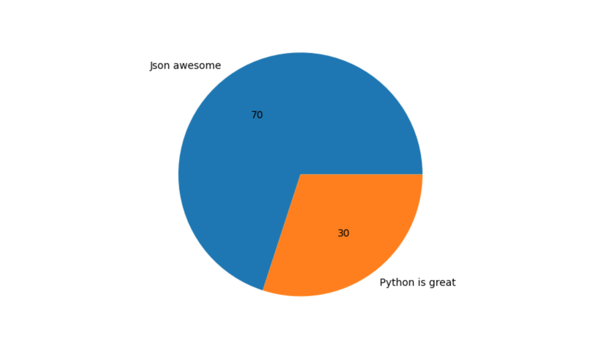

# Research

- Learn http url format (https://host/path?queryKey1=value1&queryKey2=value2)  

   `https` -  the protocol used (HTTP or HTTPS).
   `host` - the domain name.
   `path` - the directory path.
   `queryKey1=value1&queryKey2=value2` - additional parameters. The first variable `queryKey1` has the value of `value1`, the second one (`queryKey2`) - value of `value2`.

- Learn what is base64
   
   `base64` is a method of encoding binary data into ASCII characters (64 of them in total: A-Z, a-z, 0-9, +, /).
- Learn what is json  

   `JSON` is a lightweight format for storing and transporting data which is often used when data is sent from a server to a web page.

- Learn what is xml
   
   `XML` (eXtensible Markup Language) is a markup language that defines a set of rules for encoding documents in a format that is both human-readable and machine-readable. It was designed to store and transport data, to be self-descriptive.

- Learn common http headers and what they are used for (content-type, cookie, accept-language etc.)  

   `content-type` header is used to indicate the media type of the resource. The media type is a string sent along with the file indicating the format of the file (for an image it can be like `image/png`).  
   `cookie` header is used in the requests sent by the user to the server (user=Nastya).  
   `accept-language` header tells the server about all the languages that the client can understand (`en-US` - the value is English of US).

- What is a website?
   
   A `website` is a collection of web pages, which share the same domain name.

- What is a web server?
   
   A `web server` is computer software and underlying hardware that accepts requests via HTTP or HTTPS.

- What is HTML?  
   
   `HTML` (Hypertext Markup Language) is the standard markup language for creating web pages. It defines the structure and layout of a web page.  

- What is JavaScript?
   
   `JavaScript` is a high-level programming language that is primarily used to add interactivity and dynamic behavior to web pages.

- What is CSS?
   
   `CSS` (Cascading Style Sheets) is a style sheet language used for describing the presentation of a document written in HTML. It is used to create a design for web pages. 

# Security

- How a dns server can fake you.  

   If the DNS server has been compromised, it could redirect your request to a fake website, which looks the same as the website you wanted to visit. The aim is to steal your sensitive information such as login and password.

- Why it is not safe to use http instead of https.  

   HTTP transmits data in plain text, making it possible to be intercepted and manipulated by attackers. But HTTPS encrypts the data being transmitted, providing a secure connection between the browser and the web server. 

- What is phishing and how they are done.
   `Phishing` is an attempt to steal sensitive information (usernames, passwords, credit card numbers, bank account information or other important data).  
   These attacks typically occur via email or message. 
   1. An attacker sends an email (or a message) to the victim. Smth like: "Hello, it's [bank's name], your account has been blocked. Visit the website, if it was an accident. [Link here] Kind regards, [bank's name]". 
   2. The recipient clicks on the link in email (or message) and goes to the phishing website, which looks exactly like a legitimate one.
   3. On the phishing website recipient enters his sensitive data, which an attacker collects.
   4. Then the attacker uses collected data to access a legitimate website and will probably steal recipient's money. 


# Web 


- Write one page hello world html and execute it in the browser.
   
   [_View: helloWorld.html_](code/partWeb/helloWorld.html)  

   
- Write one page html with use of css and execute it in the browser. (You can design a button with style field. Make it pretty :)

   Don't click the button yet, wait for the next task.   

   [_View: button.html_](code/partWeb/button.html)  

   

- Write one page html with use of javascript and execute it in the browser. (You can design a button which calls javascript function when user clicks over it.)  
   
   I have added a js function to the previous task, so check it out, click the button.

   [_View: button.html_](code/partWeb/button.html)

- Write one page portfolio site with use of css and javascript and execute it in the browser. You should use `<li>`, `<ul>`, `<a>`, ``, `<div>`, `<h1>`, `<h2>`, `<h3>` (Even more components. You can use further). Give beautiful colors to texts and make the page background developer friendly dark :)
   
   Now I have to confess, I know some basics of js and I had an unfinished project (about 40% was done), so I have finished it and I think it will suit for this task.   
   
   By the way you can interact with it the way you do it with the real Google. 
   
   [_View: search.html_](code/partWeb/search/search.html)  

   

   P.S. there are no `<li>`, `<ul>`, `<h1>`, `<h2>`, `<h3>` because they are not needed for this project. But there are some other elements.

- Serve your one page site with python flask in path of `/html1`. (Dont forget to set the response header `Content-Type` as `text/html`.)   
   
   [_View: serve.py_](code/partWeb/serve.py)  

     

- Write basic html page with a form and a submit button. Take name, surname, username and password with the form. When the form is submitted, it should send a post request to the http server that you'll prepare. (Note: Serve your html page in path of `/register` and use the same path. Response should be another html page with the information that you've taken from the form.)   
   
   [_View: serveRegister.py_](code/partWeb/serveRegister.py)
   
   
   
   


# App assignments

## Walking man animation.

Hardness: `2/10`
Hint: `You can prepare your animation frame by frame with as ascii art (use #-o+| etc).`

Take speed int from the user and according to this prepare walking stick man animation. (You can use clear command to clean the terminal screen)  
   
   [_View: walkingMan.py_](code/partAppAssignments/walkingMan.py)

   

## p2p Chat 

Hardness: `5/10`

Real time chat application with tcp. It should be P2P (Every client can be server). Message reciever should also get the username of the sender. Also it should save the chat history to the file which names as same username with the username of the other person.

Sample executing:
```bash
# Start one peer
python3 chat.py nastia server 8080

# Start another peer and let them connect
python3 chat.py raif client localhost:8080
```

Sample chat screen:

```text
User raif connected to the chat [date comes here]!

nastia> Selam
raif [date comes here]> Selam. Naber?
nastia> [waits nastia to type something to the terminal]
```

Hint: `import sys and use sys.argv to get params from the command line (e.g.   username = sys.argv[1])`
Hint: `Send user informations as far as connected to the peer. Let client peer send firts`
```text
client -> connects -> server
client -> sends "I am raif" -> server
server -> sends "I am nastia" -> client

chat starts
```
Hint: `Use Threading to read the peer data in the background. With that way you can also read your terminal console at the same time.`

Tcp guess the word game. It will be multiple player. System will assign a word to one user, user to let the other user guess the assigned word without typing forbidden words. So system should give forbidden words and check does user use these words. Also other user should have chance to let the other user describe it's own assigned word with the same rule. :: make this game as server and client. 

[_View: chat.py_](code/partAppAssignments/chat.py)


## image api

Hardness: `3/10`

Use flask as http server framework. Every endpoint should return the image. So don't forget to set the response header `Content-Type` as `image/png` or `image/jpeg`.

- `/chart` Make pie chart with mathplotlib. Use json array body format: `[{"label":"Json awesome","value":70},{"label":"Python is great","value":30}]`. Example request: `curl localhost:3132/chart -d '[{"label":"Json awesome","value":70},{"label":"Python is great","value":30}]`
`/qr` Qr code generator. Take the data from the query which named as `qr_data`. Use default size as 50x50 if it is not given in the query which names as `size`. Example request: `curl localhost:3132/qr?qr_data=Gunaydin&size=100`
`/barcode` Barcode generator. Take the data from the query which named as `barcode_data`. Use default size as 50x50 if it is not given in the query which names as `size`. Example request: `curl localhost:3132/barcode?barcode_data=iyi+geceler&size=100`
`/captcha` captcha image generator with it's text value (type the text of the captcha to the response header `X-Nastia-Catpcha-Value`). Example request: `curl localhost:3132/captcha`
  
   [_View: api.py_](code/partAppAssignments/api.py)

- chart
   
   

   Command used:
   ```bash
   curl --json '[{"label":"Json awesome","value":70},{"label":"Python is great","value":30}]' http://localhost:3132/chart
   ```
   or
   ```bash
   curl -X POST -H "Content-Type: application/json" -d '[{"label":"Json awesome","value":70},{"label":"Python is great","value":30}]' http://localhost:3132/chart
   ``` 

   The first command has a `--json` flag which automatically sets the `Content-Type` header to `application/json`.
- qr 

   

   Command used:
   ```bash
   curl 'localhost:3132/qr?qr_data=Gunaydin&size=100'  
   ```
- barcode

   

   Comand used: 
   ```bash
   curl 'http://localhost:3132/barcode?text=iyi+geceler'
   ```

- captcha 

   

   Command used:
   ```bash
   curl http://localhost:3132/captcha
   ```

## url shortner

Hardness: `4/10`

Use flask as http server framework. Use file to store id information (every id should represent an full url). Store these information as json in file.

Example file format:

```json
{
    "gog": "https://www.google.com",
    "yoy": "https://www.youtube.com"
}
```

Example http request:

```bash
curl -v localhost:3132/go/gog' # it should redirect to the https://www.google.com
```

Write `/shorten` endpoint for save new short url. It should take the full url from the query. If query doesn't have id query, it should generate a random id. Finally it should return the short url as response.
For sure dont forget to save the new short url to the file as json. For this, you can read the file, parse the json and add the id with the url. Finally you can encode to the json and write to the file again.

Example http request:

```bash
curl -v localhost:3132/shorten?url=https://www.facebook.com # response: "localhost:3132/go/slGjrandomid"
curl -v localhost:3132/shorten?url=https://www.facebook.com&id=fb # response: "localhost:3132/go/fb"
```
   [_View: url.py_](code/partAppAssignments/url.py)

   


## url shortner website

Use the previous url shortner for this. Add `POST` handler for the `/shorten` which accepts data from the html form. In the path of `/panel` you should return beautiful html page with the list of the short urls and their full urls. Also you should have a form to add new short url. When the form is submitted to the path of `/shortner`, it should save the new short url and redirect to the panel page again.

   [_View: urlWeb.py_](code/partAppAssignments/urlWeb.py)

    

   Short URL `yuIzna` for instagram in the last row is generated randomly because `ID` was not entered. 
   
   
